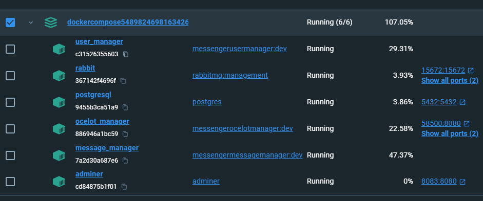

# Итоговая аттестация
# Технологическая специализация: **.Net разработчик**

## Обязательное задание
## Проект backend “мессенджер-приложения” на ASP.Net
### Краткое описание задания
Используя фреймворк ASP Net Core создайте набор backend сервисов посредством которых пользователя смогут регистрироваться и обмениваться сообщениями. Приложение должно содержать минимум два микро-сервиса:

- [x] API регистрации пользователей и API получения и обмена сообщениями.
Организуйте доступ к сервисам через API Gateway
    #### Подробное описание задания
    - [x] Создайте проект ASP.Net Core и приложение(я) почтового ящика. Создайте два
    микросервиса: работа с пользователями и работа с сообщениями.
        - [x] **Сервис пользователей**
            *Обладает следующим функционалом:*
            - [x] Сервис должен уметь регистрировать пользователей предоставляя
              соответствующий метод API. В качестве имени пользователя нужно
              использовать email, в качестве пароля произвольную строку
            - [x] Сервис должен уметь добавлять и аутентифицировать пользователей на
              основе асимметричного шифрования RSA
            - [x] Методы
                - [x] Добавить администратора (первый пользователь в системе)
                - [x] Добавить пользователя (обязательна проверка на дублирующиеся имена/адреса)
                - [x] Получить список пользователей
                - [x] Удалить пользователя (доступ только у администратора), администратор не может удалить сам себя
                - [x] Метод возвращающий ID пользователя при обращении с JWT-token (для проверки работоспособности API)
            - [x] База данных
                - [x] Пользователи
                - [x] Роли
            - [x] ID пользователя, который будет использоваться в сервисе обмена
              сообщениями должен быть добавлен в JWT(Claim) для использования в
              качестве ID в сервисе сообщений

        - [x] **Сервис сообщений** Предназначен для обмена сообщениями между авторизованными пользователями. *Обладает следующим функционалом*:
            - [x] Сервис позволяет отправлять сообщения от имени авторизованного пользователя.
            - [x] Сервис позволяет получать сообщения предназначенные для авторизованного пользователя
            - [x] Сервис помечает полученные сообщения во избежание повторной отправки
            - [x] Сервис получает только те сообщения которые не помечены как полученные
            - [x] Методы
                - [x] Получить сообщения
                - [x] Отправить сообщение
            - [x] База данных
              - [x] Сообщения
        - [x] Пользователи
            - [x] Авторизуются через сервис пользователей
            - [x] Clam’ы JWT должны содержать Guid пользователя
  
# Инструменты и рекомендации
##  Используется следующие инструменты:
  - [ ] Autofac - заменен на **NSubstitute** + **FluentAssertions** на **xUnit**
  - [x] Automapper (не обязательно, но будет плюс)
  - [x] Postgresql в качестве базы данных
##  Реализуйте:
  - [x] Конфигурацию базы данных через конфиг-файл
  - [x] Automapper (будет плюс)
  - [x] Проверку длины пароля (будет плюс)
  - [x] Проверку сложности пароля
  - [x] Проверку валидности имени пользователя (email в соответствии с шаблоном)
##  Тестирование
- [x] Напишите Unit-тесты для вашего решения.
- [x] Postman
  - [x] Для тестирования вашего решения подготовьте коллекцию в Postman покрывающую всех API-вызовы обоих сервисов.
  
  
 
### Дополнительное задание
- [x] Реализуйте API-Gateway объединяющий методы обоих сервисов, настройте Swagger для API Gateway
    - [x] Описание задания 1
        
        Используя Ocelot реализуйте API-Gateway сервис предоставляющий доступ ко всем методам сервиса основного задания
    
    - [x] Описание задание 2*
        
        Настройте Swagger for Ocelot таким образом чтобы у после запуска API Gateway Swagger можно было получить доступ ко всем методам обоих сервисов

# Ocelot

# Docker
